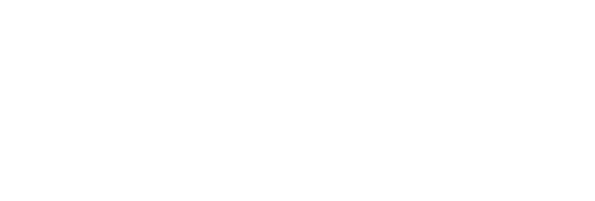
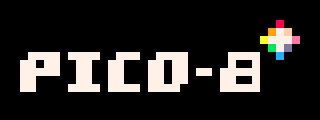
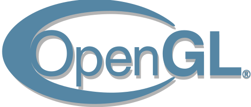

# Heil og Sæl 👋,**Eysteinn** heiti ég en vinir mínir kalla mig ✨ **Eista** ✨

Tölvunarfæðinemi með áherslu á leikjaþróun í Háskóla Reykjavík. Ætlast til að fikta mikið með leikjavélar og er komin langa leið núþegar. Einnig er mikil áhugi fyrir leikja-hönnun, gervigreind, flott viðmót, vefforritun og smá dass af vefþjónustum.
* 📰 Stanslaust að skoða eitthvað nýtt og áhugvert nema þegar ég er að spila leiki.
* 🧹 Clean code, kóðinn sem ég skrifa á að vera læsilegur, skiljanlegur og viðhaldshæfur (eða ég **vona** það).
* 📂 Open source, deili öllu flottu sem ég geri (þegar það er tilbúið).
* 💻 Það sem ég er að fikta í núna;
  * 🤖 Gevigreind! Smá af Negamax, smá af CSP's, smá af MCTS, Beysian networks og margt meira.
  * 🆎 **C++** og líka bara hið klassíska **C**, bara til að dýpka þekkinguna mína með þessum kröftugum tungumálum (og stýrikerfi).
  * 🃏 Vefsíðu fyrir flottu verkefnin mín, ferilskrá og flott viðmót (eista.is  wip). 
* 📬 Endilega hafðu samband við mig, upplýsingar mun verða á vefsíðu minni annars er email og linkedinn líka gott.
* 🎮 Hérna fyrir neðan er tækni sem ég hef komið í snertingu við.

  
  
  
  
  
  
  
  
  

<!--
**eysta00/eysta00** is a ✨ _special_ ✨ repository because its `README.md` (this file) appears on your GitHub profile.

Here are some ideas to get you started:

- 🔭 I’m currently working on ...
- 🌱 I’m currently learning ...
- 👯 I’m looking to collaborate on ...
- 🤔 I’m looking for help with ...
- 💬 Ask me about ...
- 📫 How to reach me: ...
- 😄 Pronouns: ...
- ⚡ Fun fact: ...
-->
